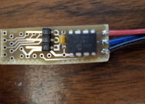
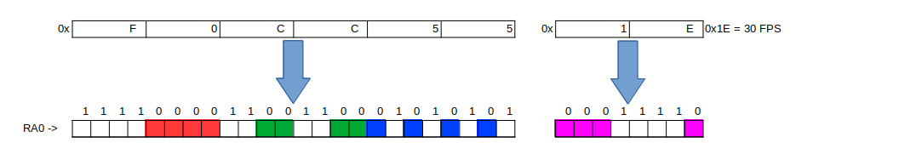

# WS281X-Splitter Overview

WS281X-Splitter has 2 main purposes:
1. (Splitter) Split one long string of WS281X pixels into multiple (up to 4) shorter strings.  This can be used as an alternative to daisy-chaining multiple WS281X strips/strings and/or to avoid the need for null pixels - the distance to first pixel is considerably longer (~ 30 feet) than the distance between pixels (~ 2 feet).
2. (Breakout) Show the next WS281X RGB data pattern (24 bits) at the current position within a group of WS281X pixels, and current FPS (8 bits).  This breakout info can be used to diagnose controller or communication problems.

The firmware is written specifically for the Microchip PIC16F15313, but can be adapted to some other PICs.  The firmware uses Timers 0-2, MSSP, PWM, and CLC peripherals.  The CLC allows WS281X signal data to be sent and received at full speed (800 KHz) using a low-power 8 MIPS 8-bit microcontroller.

The hardware is designed to be inlinable with WS281X strips.  For example, here is a prototype PCB using minimal parts:

## Usage as Splitter

Connect WS281X-splitter as follows to use the splitter function:
- WS281X input data stream on RA3
- up to 4 WS281X strips/strings on RA1, RA2, RA5, and RA4

In your sequencing software, the splitter will be represented by 1 WS281X pixel followed by another string of WS281X pixels which will be split into 1-4 segments. Insert the extra pixel immediately *ahead* of the pixels to be split.  Set its 24-bit value to the quad-length* of the first, second, and third segments respectively.  Any pixel values after the first + second + third length will be sent to the fourth segment.  For example, a splitter pixel value of 0x102003 will redirect the WS281X input stream on RA3 as follows:
- the next 4 * 0x10 = 64 pixels will go to Segment 1 on RA1
- then 4 * 0x20 = 128 pixels will go to Segment 2 on RA2
- and then 4 * 0x03 = 12 pixels will go to Segment 3 on RA5
- any remaining pixels values will go to Segment 4 on RA4

*Quad-length is 1/4 the number of WS281X pixels in a segment.  This allows an 8-bit value to designate a length up to 1024 pixels.

## Usage as Breakout

To use the breakout function, connect RA3 of the WS281X-Splitter to the end of a WS281X pixel strip/string (or directly to a WS281X controller port) and then connect 24 or 32 WS281X pixels to RA0.  The first 24-bit RGB WS281X pixel value received by WS281X-Splitter will be broken out as follows:
- the first 24 WS281X pixels on RA0 will show the 24-bit RGB pixel value received (msb first)
- if more than 24 pixels are connected to RA0, then the next 8 pixels will display the FPS (msb first)

In the breakout, white pixels represent an "on" bit and red/green/blue/cyan represents an "off" bit within the first/second/third/fourth bytes.  For example, a pixel value of 0xF0CC55 received at 30 FPS would be displayed as follows:

In your sequencing software, the only change needed is to insert one WS281X pixel representing where the WS281X-Splitter is connected.

# Current Status
* firmware still under development
* example PCB done (see pcb folder)

# Build Instructions
To assemble the firmware use steps 1 - 4, below.  To use the pre-assembled .hex file, skip directly to step 4.
1. Clone this repo
2. Install Microchip MPLABX 5.35 or GPASM or equivalent tool chain.  Note that MPLABX 5.35 was the last version that supported *MPASM* rather than *MPASMX*.
3. Build the project
4. Flash the dist/WS281X-Splitter.hex file onto a PIC16F15313*.  Example command line (for Linux):
sudo ./pkcmd-lx-x86_64.AppImage -w -p16f15313 -fdist/WS281X-Splitter.hex -mpc -zv

* PIC16F15313 is a newer device supported by PICKit3.  However, it can be programmed using the older PICKit2 and the very useful [PICKitPlus software](https://anobium.co.uk).

# Version History

Version 0.21.9 9/30/21 switched to 8-bit PIC with CLC. basic split and breakout functions working for PIC16F15313
Version 0.15.0 ?/?/16 started working on a Xilinx XC9572XL CPLD (72 macrocells) on a Guzunty board

# Reference Docs
- [MPLABX older versions](https://www.microchip.com/en-us/development-tools-tools-and-software/mplab-ecosystem-downloads-archive)
- [PIC16F15313](https://www.microchip.com/en-us/product/PIC16F15313)
- [AN1606](https://ww1.microchip.com/downloads/en/AppNotes/00001606A.pdf)
- [PICKitPlus](https://github.com/Anobium/PICKitPlus)
- [PICKitPlus command line](https://github.com/Anobium/PICKitPlus/wiki/pkcmd_lx_introduction)

### (eof)
